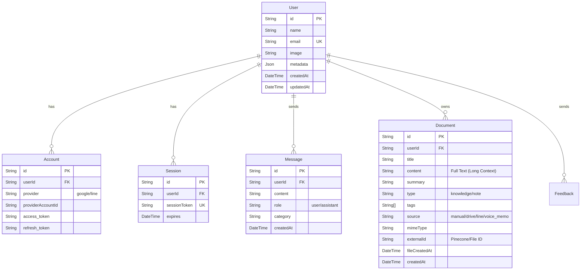

# データベース設計書 (Database Schema)

## 1. 概要
*   **Database**: PostgreSQL
*   **ORM**: Prisma
*   **Vector DB**: Pinecone (別途管理)

## 2. ER図 (Mermaid)

## 3. テーブル定義詳細

### 3.1. User
ユーザー情報を管理します。
*   `id`: CUID (Primary Key)
*   `email`: メールアドレス (Unique)
*   `name`: 表示名
*   `image`: プロフィール画像URL
*   `metadata`: 任意のJSONデータ

### 3.2. Document
知識ベースとなるドキュメント情報を管理します。
*   `id`: CUID (Primary Key)
*   `userId`: 所有ユーザーID (Foreign Key)
*   `title`: ファイル名またはタイトル
*   `content`: **全文データ**。RAGのLong Context検索時に使用されます。
*   `summary`: 要約テキスト。
*   `tags`: タグの配列 (例: `["仕事", "Python"]`)。
*   `source`: 情報源 (`google-drive`, `manual`, `voice_memo`, `line`)。
*   `mimeType`: ファイル形式 (`application/pdf`, `audio/mpeg` 等)。
*   `externalId`: 外部ID (Google Drive ID や UUID)。PineconeのMetadata `fileId` と対応します。
*   `fileCreatedAt`: ファイル自体の作成日時。

### 3.3. Message
チャット履歴を保存します。
*   `id`: CUID (Primary Key)
*   `userId`: 送信ユーザーID (Foreign Key)
*   `content`: メッセージ本文。
*   `role`: `user` または `assistant`。
*   `category`: メッセージのカテゴリ（意図分類結果など）。

### 3.4. Account & Session
NextAuth.js が使用する認証用テーブルです。
*   `Account`: OAuthプロバイダ（Google, LINE）のトークン情報を管理。
*   `Session`: ログインセッションを管理。

## 4. Pinecone Schema (Vector DB)
Pineconeはスキーマレスですが、以下のMetadata構造で運用します。

### Index: `myragapp`

| Field | Type | Description |
| :--- | :--- | :--- |
| `id` | String | `{userId}#{fileId}#{chunkIndex}` |
| `values` | List[Float] | Embedding Vector (768 dim for text-embedding-004) |
| `metadata.userId` | String | ユーザーID (フィルタリング用) |
| `metadata.fileId` | String | ファイルID (Document.externalId と対応) |
| `metadata.dbId` | String | PostgreSQLのDocument ID (コンテンツ取得用) |
| `metadata.tags` | List[String] | タグ (フィルタリング用) |
| `metadata.text` | String | チャンクテキスト (Fallback用) |
| `metadata.chunkIndex` | Number | チャンク番号 |
| `metadata.type` | String | `transcript`, `summary` 等 |
