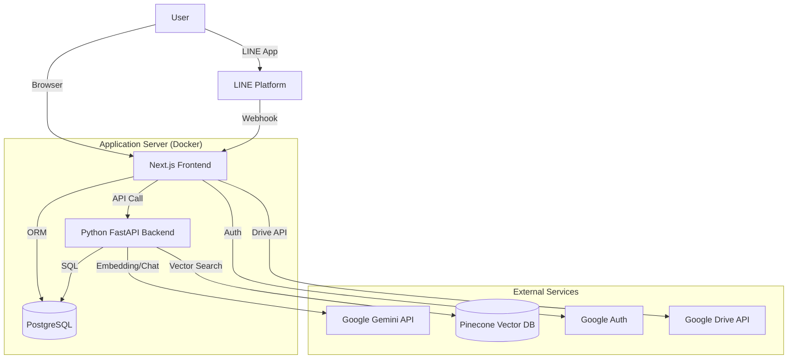

# 設計仕様書 (design.md)

## 1. システムアーキテクチャ



### 1.1. コンポーネント役割
*   **Next.js Frontend (App Router)**:
    *   ユーザーインターフェースの提供。
    *   認証 (NextAuth.js) の管理。
    *   BFF (Backend for Frontend) として、DBへの直接アクセスや外部APIとの連携を行う。
    *   LINE Webhookのエンドポイント (`/api/webhook/line`)。
*   **Python FastAPI Backend**:
    *   **ポート**: 8000
    *   **役割**: 計算リソースを要する処理、Pythonライブラリが豊富な処理を担当。
    *   **機能**:
        *   PDF/画像からのテキスト抽出 (OCR含む)。
        *   テキストのチャンク分割 (LangChain)。
        *   Embedding生成 (Gemini API)。
        *   PineconeへのUpsert / Query。
        *   音声文字起こし。
*   **PostgreSQL**:
    *   ユーザーデータ、セッション、ドキュメントのメタデータと**全文コンテンツ**、チャット履歴を保存。
*   **Pinecone**:
    *   ドキュメントのベクトルデータと検索用メタデータ（タグ、ファイルID等）を保存。

## 2. データベース設計 (Schema)

### 2.1. ER図 (簡易)
*   **User**: ユーザー情報。
*   **Account**: OAuth連携情報 (Google, LINE)。
*   **Document**: インポートされた知識データ。
    *   `tags`: String[] (タグ配列)
    *   `content`: String (全文テキスト)
    *   `source`: "drive", "manual", "line"
*   **Message**: チャット履歴。
    *   `category`: String (※将来的にtagsへ移行検討)

### 2.2. データフロー
1.  **インポート時**:
    *   Frontend -> (File/Text) -> Backend
    *   Backend -> (Text Extraction) -> (Chunking) -> (Embedding) -> Pinecone
    *   Backend/Frontend -> (Full Text) -> PostgreSQL ("Document" table)
2.  **検索時 (RAG)**:
    *   Frontend -> (Query) -> Backend
    *   Backend -> (Embedding) -> Pinecone (Vector Search with Filters)
    *   Backend -> (Fetch Full Content by ID) -> PostgreSQL
    *   Backend -> (Context + Query) -> Gemini -> Answer

## 3. API インターフェース (Python Backend)

| Method | Endpoint | Description |
| :--- | :--- | :--- |
| POST | `/import-file` | ファイル(PDF/画像)を受け取り、OCR/Embedding処理を行いPineconeとDBに保存。 |
| POST | `/import-text` | テキストを受け取り、Embedding処理を行いPineconeに保存。 |
| POST | `/transcribe` | 音声ファイルを受け取り、文字起こしテキストを返す。 |
| POST | `/query` | クエリを受け取り、RAG検索を実行して回答を返す。 |
| POST | `/classify` | テキストの意図(STORE/REVIEW/CHAT)とタグを分類する。 |
| POST | `/delete-file` | 指定されたファイルIDのベクトルデータを削除する。 |

## 4. ディレクトリ構造
```
/
├── app/                 # Next.js App Router
│   ├── api/             # API Routes (BFF)
│   ├── knowledge/       # 知識管理ページ
│   ├── notes/           # ノートページ
│   └── ...
├── backend/             # Python FastAPI Application
│   ├── main.py          # エントリーポイント
│   ├── Dockerfile       # Python環境定義
│   └── requirements.txt # Python依存ライブラリ
├── prisma/              # Prisma Schema & Migrations
├── src/
│   ├── lib/             # ユーティリティ (gemini.ts, pinecone.ts, prisma.ts)
│   └── services/        # ビジネスロジック (knowledge.ts)
├── .agent/              # エージェント用ドキュメント (本ファイル等)
└── docker-compose.yml   # コンテナ構成
```
