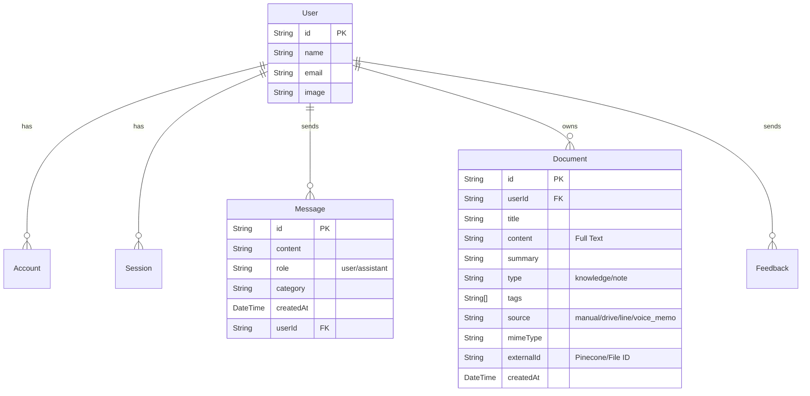

# 設計仕様書 (design.md)

## 1. システムアーキテクチャ

```mermaid
graph TD
    User[User] -->|Browser| Cloudflare[Cloudflare (DNS/CDN)]
    Cloudflare -->|HTTPS| CloudRun[Google Cloud Run]
    
    subgraph "Cloud Run Services"
        CloudRun --> Frontend[Next.js Frontend]
        CloudRun --> Backend[Python FastAPI Backend]
    end
    
    User -->|LINE App| LINE[LINE Platform]
    LINE -->|Webhook| Frontend
    
    Frontend -->|API Call| Backend
    Frontend -->|ORM| DB[(PostgreSQL)]
    Backend -->|SQL| DB
    
    subgraph "External Services"
        Backend -->|Embedding/Chat| Gemini[Google Gemini API]
        Backend -->|Vector Search| Pinecone[(Pinecone Vector DB)]
        Frontend -->|Auth| GoogleAuth[Google Auth]
        Frontend -->|Drive API| GDrive[Google Drive API]
    end
```

### 1.1. コンポーネント役割
*   **Next.js Frontend (App Router)**:
    *   UI/UX提供、認証 (NextAuth.js)、LINE Webhook処理。
    *   BFFとしてBackend APIをコール。
*   **Python FastAPI Backend**:
    *   **ポート**: 8000
    *   **機能**:
        *   **ファイル処理**: PDF, Office, 画像のテキスト抽出 (OCR含む)。
        *   **音声処理**: Gemini 2.0 Flash による文字起こし・要約。
        *   **RAG**: Embedding生成, Pinecone Upsert, Cross-Encoder Re-ranking。
*   **PostgreSQL**:
    *   ユーザー情報, チャット履歴, ドキュメントのメタデータと全文。
*   **Pinecone**:
    *   ドキュメントのベクトルデータ (Metadata: `userId`, `fileId`, `tags` 等)。

## 2. データベース設計 (Schema)

### 2.1. ER図


## 3. API インターフェース (Python Backend)

| Method | Endpoint | Description |
| :--- | :--- | :--- |
| POST | `/import-file` | 汎用インポート (PDF/画像/Office/CSV)。MIMEタイプで自動判別。 |
| POST | `/import-text` | テキスト直接登録。 |
| POST | `/process-voice-memo` | 音声ファイルの文字起こし・要約・保存。 |
| POST | `/delete-file` | 指定ファイルのベクトル削除。 |
| POST | `/update-tags` | 指定ファイルのタグ更新。 |
| POST | `/process-pdf` | (Legacy) PDF専用処理。 |
| POST | `/process-image` | (Legacy) 画像専用処理。 |

## 4. ディレクトリ構造
```
/
├── app/                 # Next.js App Router
│   ├── api/             # API Routes (BFF, Webhook)
│   ├── knowledge/       # 知識管理画面
│   ├── profile/         # プロフィール画面
│   └── ...
├── backend/             # Python FastAPI Application
│   ├── main.py          # エントリーポイント & ロジック
│   └── Dockerfile       # Python環境定義
├── prisma/              # Prisma Schema
├── src/
│   ├── lib/             # Utilities (gemini, pinecone, line)
│   └── services/        # Service Layer
├── .agent/              # エージェント用ドキュメント (本ファイル等)
└── cloudbuild.yaml      # CI/CD設定
```
