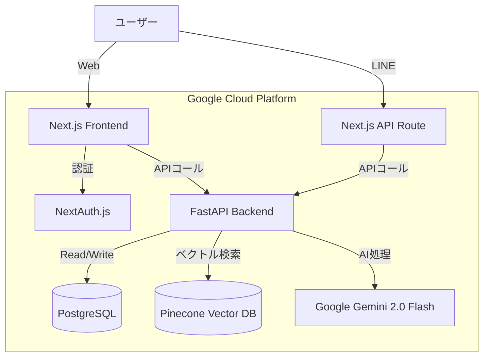

# システム仕様書 (System Specification)

## 1. アーキテクチャ概要
フロントエンド (UI/認証) と バックエンド (AI/ロジック) を分離した **マイクロサービスライク** な構成を採用しています。

## 2. 技術スタック

### フロントエンド
*   **フレームワーク**: Next.js 14+ (App Router)
*   **言語**: TypeScript
*   **スタイリング**: Tailwind CSS, Vanilla CSS (ネオブルータリズム/モダンデザイン)
*   **認証**: NextAuth.js v5 (Google, LINE プロバイダ)
*   **状態管理**: React Context (ChatContext, SidebarContext)

### バックエンド
*   **フレームワーク**: FastAPI (Python)
*   **言語**: Python 3.11+
*   **AIモデル**: Google Gemini 2.0 Flash (`google-generativeai` SDK)
*   **ベクトルDB**: Pinecone
*   **データベース**: PostgreSQL (`asyncpg` for Python, `prisma` for Next.js)
*   **ツール**: LangChain (テキスト分割), PyPDF, Pandas (Excel), python-docx, python-pptx.

### インフラストラクチャ
*   **コンテナ化**: Docker, Docker Compose
*   **CI/CD**: Google Cloud Build
*   **ホスティング**: Google Cloud Run
*   **データベース**: Google Cloud SQL (PostgreSQL) または Supabase (開発用)

## 3. データフロー

### 3.1 ファイルインポートフロー
1.  **アップロード**: ユーザーがWeb UI (`ManualAdd.tsx`) からファイルをアップロード。
2.  **登録**: Next.js が PostgreSQL に `Document` レコードを作成 (ステータス: pending)。
3.  **処理開始**: Next.js が Python Backend (`/import-file`) にファイルを送信。
4.  **抽出**: Python Backend が MIMEタイプを判別し、テキストを抽出 (画像/PDFはOCR、音声は文字起こし)。
5.  **分割・埋め込み**: テキストをチャンクに分割し、Gemini (`text-embedding-004`) でベクトル化。
6.  **保存**:
    *   **ベクトル**: Pinecone にメタデータ (`userId`, `fileId`, `tags`) と共に保存。
    *   **コンテンツ**: 全文テキストと要約を PostgreSQL の `Document` レコードに更新。

### 3.2 RAGチャットフロー
1.  **クエリ**: ユーザーがチャットUIまたはLINEからメッセージを送信。
2.  **検索**: Python Backend (`/query`) がクエリをベクトル化し、Pinecone を検索。
3.  **取得**: 上位K件の一致を取得。
    *   *ハイブリッド*: 完全な文脈が必要な場合、PostgreSQL から `dbId` を使って全文を取得。
4.  **生成**: Gemini 2.0 Flash が、取得した文脈 + Google検索 (グラウンディング) を元に回答を生成。
5.  **応答**: 回答をユーザーにストリーミング/返却。

## 4. データベース構成 (概念)

### PostgreSQL
*   **User**: ユーザープロファイル、設定。
*   **Document**: メタデータ (タイトル, タイプ, タグ) + コンテンツ (テキスト, 要約)。
*   **Message**: チャット履歴 (User/Assistant)。
*   **Account**: OAuthトークン。

### Pinecone (Index: `myragapp`)
*   **Namespace**: なし (メタデータ `userId` でフィルタリング)。
*   **Metadata**: `userId`, `fileId`, `chunkIndex`, `tags`, `text` (チャンク内容)。
