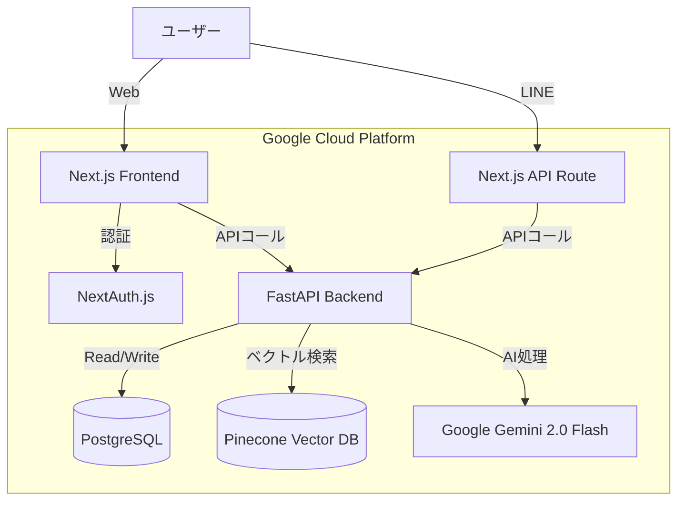

# システム仕様書 (System Specification)

## 1. アーキテクチャ概要
フロントエンド (UI/認証) と バックエンド (AI/ロジック) を分離した **マイクロサービスライク** な構成を採用しています。

## 2. 技術スタック

### フロントエンド
*   **フレームワーク**: Next.js 14+ (App Router)
*   **言語**: TypeScript
*   **スタイリング**: Tailwind CSS, Vanilla CSS (ネオブルータリズム/モダンデザイン)
*   **認証**: NextAuth.js v5 (Google, LINE プロバイダ)
*   **状態管理**: React Context (ChatContext, SidebarContext)

### バックエンド
*   **フレームワーク**: FastAPI (Python)
*   **言語**: Python 3.11+
*   **AIモデル**:
    *   **生成**: Google Gemini 2.0 Flash (`gemini-2.0-flash`) - 全ての生成タスクで使用
*   **ベクトルDB**: Pinecone (Index: `myragapp`)
*   **埋め込みモデル**: Google `models/text-embedding-004` (768次元)
*   **データベース**: PostgreSQL (`asyncpg` for Python, `prisma` for Next.js)
*   **ツール**: LangChain (テキスト分割), PyPDF, Pandas (Excel), python-docx, python-pptx, **ffmpeg** (音声処理).

### インフラストラクチャ
*   **コンテナ化**: Docker, Docker Compose
*   **CI/CD**: Google Cloud Build
*   **ホスティング**: Google Cloud Run
*   **データベース**: Google Cloud SQL (PostgreSQL) または Supabase (開発用)

## 3. 認証とユーザーライフサイクル (Authentication & Lifecycle)

### 3.1 デュアルセーフガード戦略 (Dual Safeguard Strategy)
ユーザーのプラン割り当てに関して、**整合性 (Consistency)** と **堅牢性 (Robustness)** を両立させるため、以下の二重の戦略を採用しています。

1.  **Entry Point Safeguard (Auth Hooks)**:
    *   ユーザーがログイン (`NextAuth.js`) した瞬間に、`jwt` コールバック内で `UserSubscription` の存在を確認。
    *   存在しない場合、即座にデフォルトの `FREE` プランを作成します。
    *   *目的*: アプリケーション利用開始時にデータ整合性を保証する。

2.  **Execution Safeguard (Backend Fallback)**:
    *   バックエンド (`FastAPI`) でリクエストを処理する際（例: 音声処理）、`get_user_plan` 関数でプランを取得。
    *   万が一ここでプランが見つからない場合（Authフックの失敗や直接APIコールの可能性）、ここで **Lazy Creation** を行い `FREE` プランを作成して処理を続行します。
    *   *目的*: 予期せぬデータ欠損によるクラッシュ（500エラー）を完全防衛する。

## 4. データフロー

### 3.1 音声/ファイルインポートフロー
1.  **アップロード**: ユーザーがWeb UI からファイルをアップロード（`ManualAdd.tsx`）。
2.  **APIコール**: Next.js (`/api/voice/process`) 経由または直接 Python Backend (`/process-voice-memo`) へ送信。
3.  **セーフガード & 前処理**:
    *   **プラン取得**: `get_user_plan` でユーザーのプラン (Free/Standard/Premium) を特定。
    *   **制限チェック**:
        *   **Storage Limit**: ファイル数上限チェック。
        *   **Voice Limit**: `dailyVoiceCount` チェック & インクリメント。
    *   **時間制限 (Truncation)**: プランに応じて `ffmpeg` で音声をカット (Free: 20分, Std: 90分, Pre: 180分)。
    *   **分割 (Chunking)**: Geminiのトークン制限 (約25分) を回避するため、`ffmpeg` で **10分 (600秒) 区切り** に物理分割。
4.  **AI処理 (Sequential Transcribe & Summarize)**:
    *   **文字起こし**: 各チャンクを順番に Gemini 2.0 Flash へ送信。
        *   *Retry Logic*: 429エラー (Rate Limit) 発生時は指数バックオフで自動再試行。
        *   *Rate Control*: チャンク間に待機時間 (`time.sleep`) を挿入。
    *   **統合 & 要約**: 全チャンクの文字起こしを結合 (`full_transcript`) し、最後にまとめて Gemini で要約 (`final_summary`) を生成。
        *   *Robust Parsing*: JSONではなく独自の区切り文字 (`[SUMMARY]`, `[TRANSCRIPT]`) を用いてパースエラーを防止。
5.  **保存 (Persistence)**:
    *   **ベクトルDB**: 文字起こしテキストをチャンク分割して Pinecone に保存。
    *   **RDB**: 全文と要約を PostgreSQL (`Document` table) に保存。

### 3.2 RAGチャットフロー
1.  **クエリ**: ユーザーがチャットUI (`/api/ask`) またはLINEからメッセージを送信。
2.  **保存**: Next.jsがユーザーのメッセージを `Message` テーブルに保存。
3.  **検索**: Python Backend (`/query`) へリクエスト (`userPlan` を同梱)。
    *   クエリをベクトル化し、Pinecone を検索。
    *   必要に応じてPostgreSQLから全文を取得 (Long Context)。
    *   Google検索 (Grounding) を実行 (Planによる)。
4.  **生成**: Gemini 2.0 Flash が、検索結果 + Google検索結果を元に回答を生成。
5.  **保存**: Next.jsがAIの回答を `Message` テーブルに保存。
6.  **応答**: 回答をユーザーに返却。

### 3.3 体験版 (Trial) フロー
1.  **アクセス**: 未ログインユーザーが `/` または `/trial` にアクセス。
2.  **セッション**: 初回アクセス時に `GuestSession` を作成 (Cookie: `guestSessionId`)。
3.  **チャット**:
    *   `/api/trial/chat` をコール。
    *   `GuestSession.chatCount` をチェック (Max 2)。
    *   Gemini (Search Toolなし) で回答生成。
    *   履歴を `GuestSession.messages` に保存。
4.  **音声メモ**:
    *   `/api/trial/voice` をコール。
    *   `GuestSession.voiceCount` をチェック (Max 1)。
    *   Gemini で要約生成。
    *   結果を `GuestSession.voiceMemo` に保存。

## 4. データベース構成 (概念)

### PostgreSQL (Prisma)
 主要なテーブル構成:

*   **User**: ユーザー基本情報 (Name, Email, Password等)。
*   **UserSubscription**:
    *   プラン (FREE, STANDARD, PREMIUM)。
    *   利用制限管理用のカウンタ (`dailyChatCount`, `dailyVoiceCount`, `monthlyVoiceMinutes`)。
    *   Stripe連携ID。
*   **Document**: 知識データ。メタデータ (タイトル, タイプ, タグ) + コンテンツ (テキスト, 要約)。
*   **Thread**: チャットスレッド。
*   **Message**: チャット履歴 (User/Assistant)。`Thread` に紐づく。
*   **Account**: OAuthトークン (Google, LINE)。
*   **GuestSession**: 体験版ユーザーの一時データ。
*   **Feedback**: ユーザーからのフィードバック。

### Pinecone (Index: `myragapp`)
*   **Namespace**: なし (メタデータ `userId` でフィルタリング)。
*   **Metadata**: `userId`, `fileId`, `chunkIndex`, `tags`, `text` (チャンク内容), `type` ("transcript" or "summary")。
