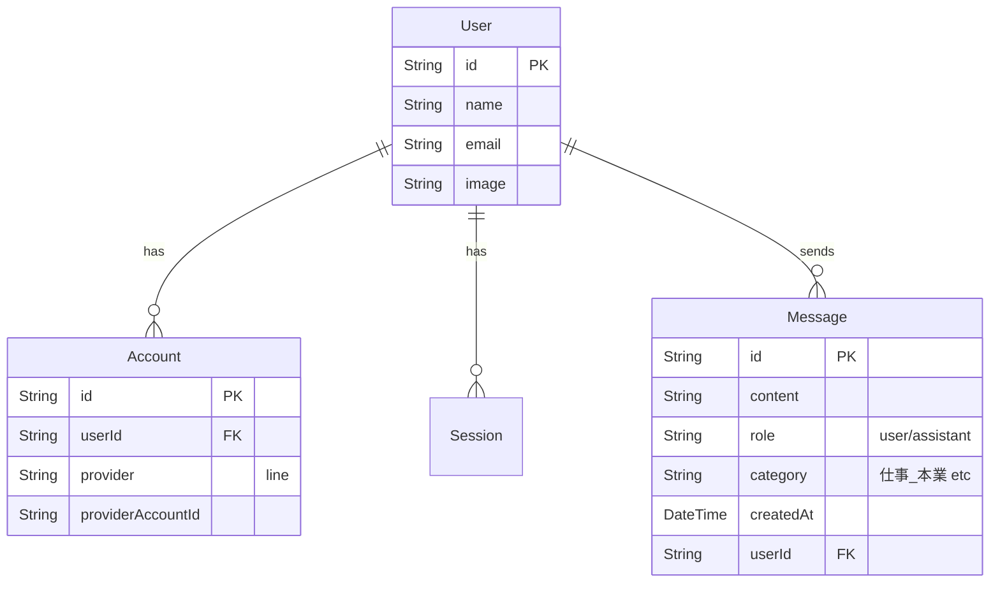

# 基本仕様書 (Basic Specifications)

## 1. システムアーキテクチャ
### 1.1 全体構成
```mermaid
graph LR
    User[User (LINE)] -->|Webhook| Vercel[Next.js App (Vercel)]
    Vercel -->|Auth| DB[(PostgreSQL)]
    Vercel -->|Vector Search| Pinecone[(Pinecone Vector DB)]
    Vercel -->|LLM| Gemini[Google Gemini API]
```

### 1.2 技術スタック
- **Frontend/Backend**: Next.js 15+ (App Router)
- **Language**: TypeScript
- **Database**: PostgreSQL (Vercel Postgres)
- **ORM**: Prisma
- **Auth**: NextAuth.js (v5)
- **Vector DB**: Pinecone
- **LLM**: Google Gemini API (gemini-2.0-flash)
- **Messaging**: LINE Messaging API
- **Infrastructure**: Vercel, Docker (開発環境)

## 2. データモデル (ER図)
### 2.1 主要テーブル


## 3. API仕様
### 3.1 LINE Webhook (`/api/webhook/line`)
LINEからのイベントを受け取り、以下のフローで処理する。

1.  **署名検証**: `x-line-signature` を検証し、不正なリクエストを弾く。
2.  **ユーザー特定**: `userId` から `Account` テーブルを検索。未登録ならエラー応答。
3.  **意図・カテゴリ分類 (Gemini)**:
    - 入力: ユーザーメッセージ
    - 出力: `{ intent: "STORE" | "SEARCH", category: "..." }`
4.  **メッセージ保存**: `Message` テーブルにユーザーの発言とカテゴリを保存。
5.  **分岐処理**:
    - **STORE (保存)**:
        - テキストをベクトル化 (Gemini Embedding)
        - Pineconeに保存 (`upsert`)
        - 「覚えました！」と返信
    - **SEARCH (検索)**:
        - テキストをベクトル化
        - Pineconeから類似情報を検索 (`query`)
        - 検索結果をコンテキストとしてGeminiに回答生成を依頼
        - 回答を返信
6.  **回答保存**: AIの返信内容を `Message` テーブルに保存。

### 3.2 意図分類ロジック
Gemini 2.0 Flashを使用し、以下のJSON形式で判定結果を取得する。
```json
{
  "intent": "STORE",
  "category": "趣味_旅行"
}
```

## 4. 環境変数
| 変数名 | 説明 |
| :--- | :--- |
| `DATABASE_URL` | PostgreSQL接続文字列 |
| `GOOGLE_API_KEY` | Gemini APIキー |
| `PINECONE_API_KEY` | Pinecone APIキー |
| `PINECONE_INDEX` | Pineconeインデックス名 |
| `LINE_CHANNEL_ACCESS_TOKEN` | LINE Botアクセストークン |
| `LINE_CHANNEL_SECRET` | LINE Botシークレット |
| `AUTH_SECRET` | NextAuth.js用シークレット |
