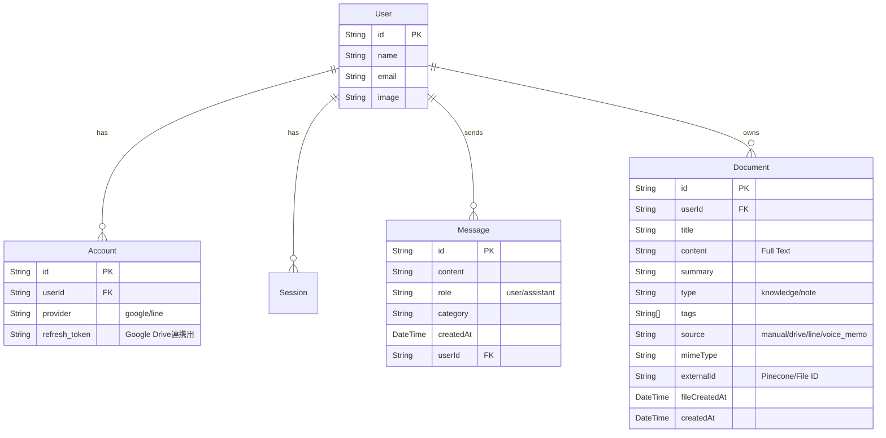

# 基本仕様書 (Basic Specifications)

## 1. システムアーキテクチャ
### 1.1 全体構成
```mermaid
graph LR
    User[User (Browser/LINE)] -->|HTTPS/Webhook| Cloudflare[Cloudflare (DNS/CDN)]
    Cloudflare --> CloudRun[Google Cloud Run]
    subgraph CloudRun
        Frontend[Next.js App]
        Backend[Python FastAPI]
    end
    Frontend -->|Auth| DB[(PostgreSQL)]
    Frontend -->|API Call| Backend
    Backend -->|Vector Search| Pinecone[(Pinecone Vector DB)]
    Backend -->|LLM| Gemini[Google Gemini API]
    Frontend -->|Import| Drive[Google Drive API]
```

### 1.2 技術スタック
- **Frontend**: Next.js 15+ (App Router)
- **Backend**: Python 3.11+ (FastAPI)
- **Language**: TypeScript, Python
- **Database**: PostgreSQL (Prisma ORM)
- **Auth**: NextAuth.js (v5) - Google / LINE Login
- **Vector DB**: Pinecone (Serverless)
- **LLM**: Google Gemini API (gemini-2.0-flash-exp)
- **Messaging**: LINE Messaging API
- **Infrastructure**: Google Cloud Run, Terraform, Docker
- **DNS**: Cloudflare (jibun-ai.com)

## 2. データモデル (ER図)
### 2.1 主要テーブル


## 3. 機能仕様
### 3.1 知識管理 (RAG)
- **登録方法**:
    - **手動入力**: テキストを直接入力して登録。
    - **Google Drive連携**: Googleドライブ上のファイルをインポート。
- **データ処理**:
    - テキストをチャンク分割し、Gemini APIでベクトル化。
    - Pineconeに保存（Metadata: `text`, `sourceFileId`）。
    - PostgreSQLにメタデータを保存（`Document`テーブル）。
- **削除処理**:
    - `Document`テーブルから削除。
    - Pineconeから `sourceFileId` が一致するベクトルを一括削除。

### 3.2 LINE連携
- **Webhook**: `/api/webhook/line` でメッセージを受信。
- **アカウント連携**:
    - プロフィール画面 (`/profile`) からLINEアカウントを後付けで連携可能。
    - 既存のGoogleログインユーザーもLINE連携することで、LINEからも同じ知識ベースを利用可能。
- **処理フロー**:
    1.  ユーザー特定（LINE User ID -> `Account` -> `User`）。
    2.  Geminiによる意図分類（保存/検索）。
    3.  RAGによる回答生成。

### 3.3 UI/UX
- **サイドバー**:
    - 折りたたみ可能（レスポンシブ対応）。
    - メニュー: チャット、知識登録、使い方、設定。
- **使い方画面 (`/usage`)**:
    - アプリの利用手順（知識登録 -> チャット -> LINE連携）を解説。

## 4. 環境変数
| 変数名 | 説明 |
| :--- | :--- |
| `DATABASE_URL` | PostgreSQL接続文字列 |
| `GOOGLE_API_KEY` | Gemini APIキー |
| `PINECONE_API_KEY` | Pinecone APIキー |
| `PINECONE_INDEX` | Pineconeインデックス名 |
| `LINE_CHANNEL_ACCESS_TOKEN` | LINE Botアクセストークン |
| `LINE_CHANNEL_SECRET` | LINE Botシークレット |
| `AUTH_SECRET` | NextAuth.js用シークレット |
| `AUTH_GOOGLE_ID` | Google OAuth Client ID |
| `AUTH_GOOGLE_SECRET` | Google OAuth Client Secret |
| `AUTH_LINE_ID` | LINE Login Channel ID |
| `AUTH_LINE_SECRET` | LINE Login Channel Secret |
| `PYTHON_BACKEND_URL` | Python Backend URL (Internal/External) |
